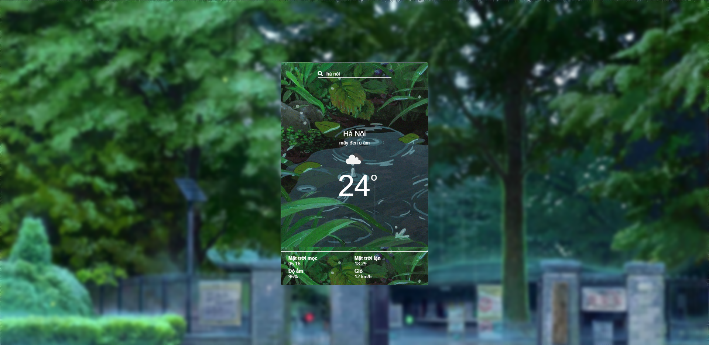

<h3 align='center'><strong>🌦 Weppa Static - HTML, CSS, JAVASCRIPT 💦</strong></h3>

### 🍄 Ngôn ngữ lập trình và công nghệ

- Dự án được phát khai và xây dựng trên 3 ngôn ngữ lập trình:

  - HTML 👨‍💻
  - CSS 🎨
  - Javascript 🧉

- Những công nghệ được áp dụng:
  - API OpeanWeatherMap 📫
  - Bootstrap 💨
  - Fontawesome 🍦

### 🔨 Những tính năng chính

- TÌm kiếm trực tiếp thời tiết 🔴
- Xem dự báo về thời tiết 🌨
- Cập nhập 24/7 💦

### 📷 Một số hình ảnh xem trước về dự án

